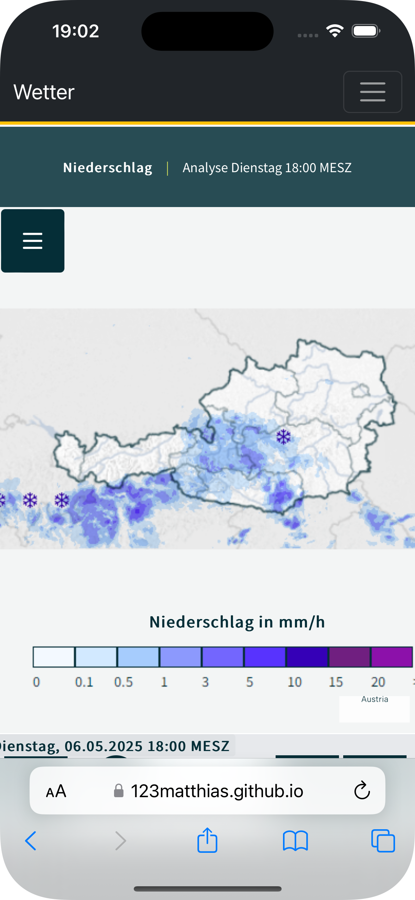
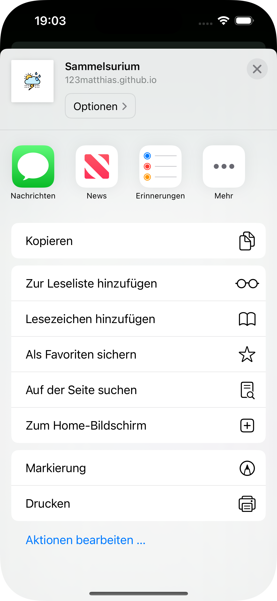
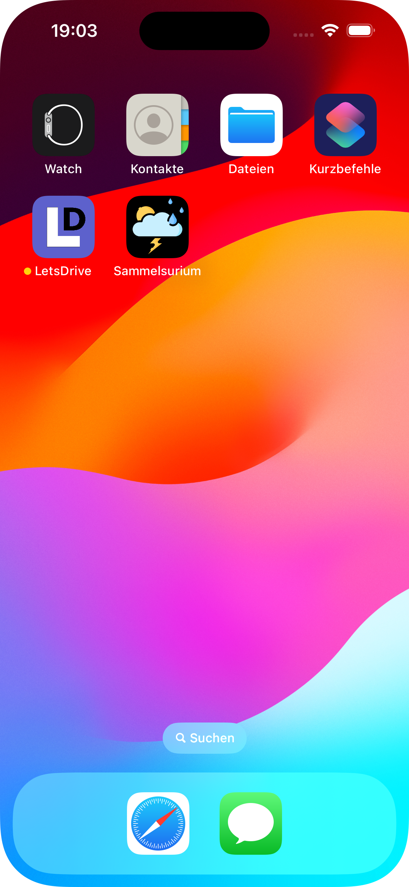

# Wetter-Sammelsurium

## Tutorial: iPhone Home-Screen-Link erstellen

### 1. URL in Safari öffnen

### 2. Auf „Zum Home-Bildschirm“ klicken und Link benennen

### 3. Der Link erscheint auf dem iOS-Home-Screen

